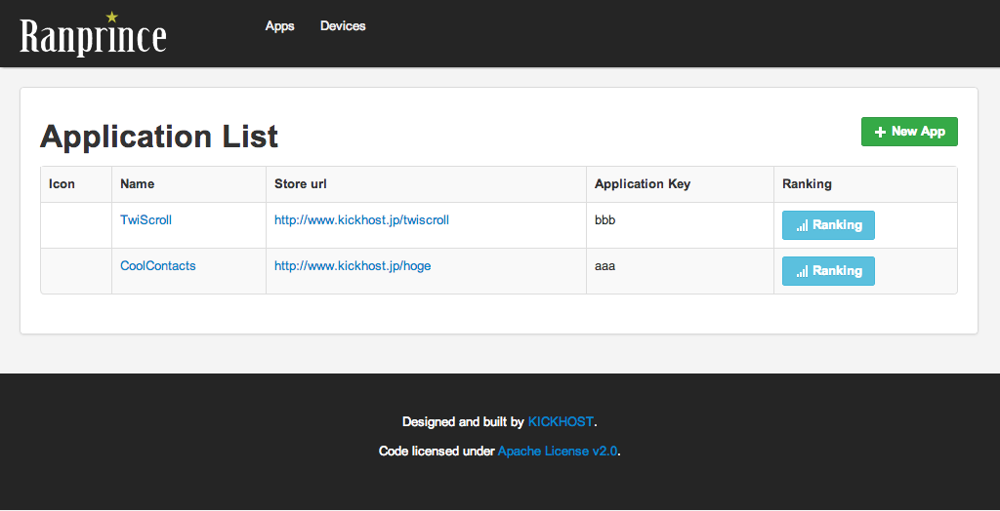

=========

Description
-------------
This project is a simple ranking system.

Features
-------------
Web
- View list of applications.
- View list of devices.
- View rankings for each application.
- Registration of the application.
- Registration of the device.

API
- View rankings for each application.
- Registration of the player.
- Registration of the score.

Screen shot
-------------

API Reference
-------------

### Ranking
- URL: /api/ranking
- Method: GET
- EX.) /api/ranking?app_key=1&device=ios&time_type=daily&order=desc

  #### Request

  ##### Parameters

  app_key (Require)
  : This is a application key.

  device
  : This is a search conditions of the device.
    - ios
    - android
    - other
    - {Blank} (Default)

  time_type
  : This is a search conditions of the time span.
    - daily
    - weekly
    - mothley
    - {Blank} (Default)

  order
  : This is the order of the ranking.
    - asc (Default)
    - desc

### Player
- URL: /api/player/create
- Method: POST

  #### Request

  ##### Parameters

  name (Require)
  : This is a player name.

  uid (Require)
  : This is a device unique id.

### ScoreReport
- URL: /api/score_reports/create
- Method: POST

  #### Request

  ##### Parameters

  app_key (Require)
  : This is a application key.

  score (Require)
  : This is a game score.

  device (Require)
  : This is a device key.
    - ios
    - android
    - other

  uid (Require)
  : This is a device unique id.

License
-------------
This project is released under the [Apache License v2.0](http://www.apache.org/licenses/LICENSE-2.0).  
Copyright (c) 2013 [KICKHOST](http://www.kickhost.jp)

